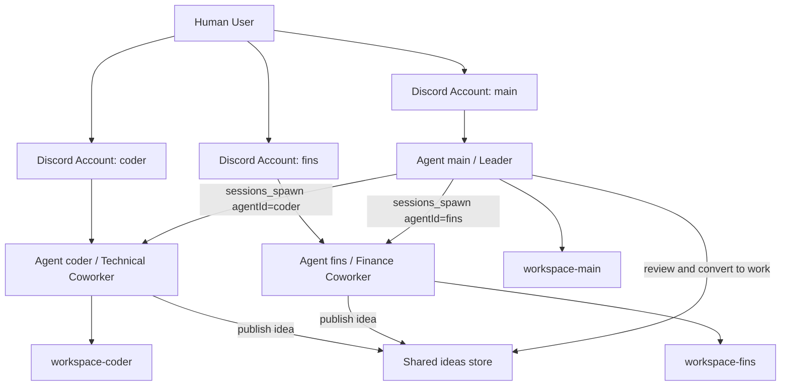
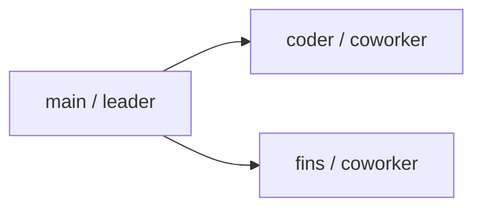
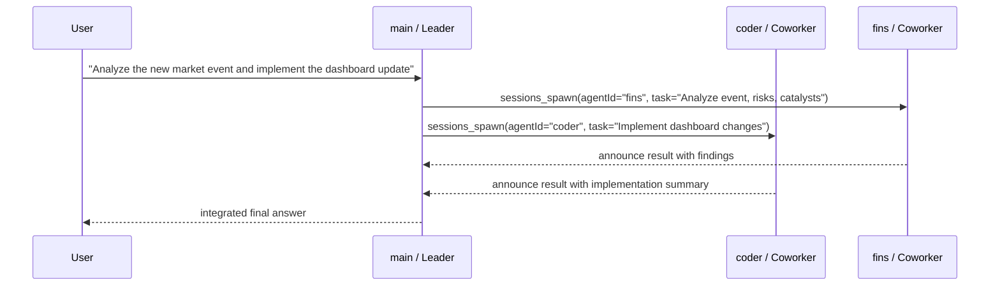
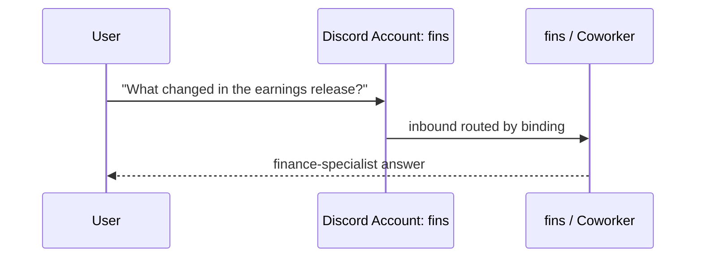
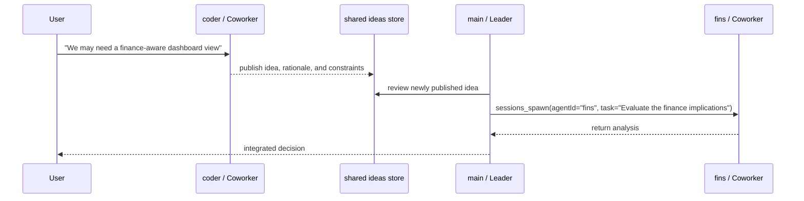

# Building a Leader-and-Coworker Multi-Agent System on OpenClaw

_Sanitized implementation guide based on a real OpenClaw deployment_

**Version context:** OpenClaw `2026.3.8`  
**Pattern:** one leader agent plus multiple specialist coworker agents  
**Audience:** builders who want a reusable, professional multi-agent architecture on top of OpenClaw  

## Executive Summary

This article explains how to build a practical multi-agent system on OpenClaw using a **leader-and-coworker** operating model:

- `main` is the **leader** agent
- `coder` is a **technical coworker**
- `fins` is a **finance coworker**

This is not just a "multiple bots" setup. It is a structured system with:

- **separate agent identities**
- **separate workspaces**
- **separate session stores**
- **clear delegation rules**
- **optional per-agent channel routing**
- **optional shared idea publication across coworkers**

The key design goal is simple:

> keep one agent responsible for strategy, final judgment, and task assignment, while specialist agents execute narrow, high-signal work and publish reusable ideas to a shared knowledge layer.

Shared knowledge is not shared authority.

All credentials, user IDs, guild IDs, channel IDs, tokens, and machine-specific identifiers in this guide are intentionally masked with professional placeholders such as `<DISCORD_BOT_TOKEN_FINS>` or `<STATE_DIR>`.

---

## 1. Why This Pattern Works

OpenClaw supports two related but different concepts:

1. **Configured agents**
   Each agent has its own workspace, `agentDir`, persona, sessions, and optional channel bindings.

2. **Sub-agent runs**
   At runtime, an agent can spawn isolated background work using `sessions_spawn`.

In a serious system, you usually need both:

- **configured agents** to define durable roles
- **spawned runs** to execute work on demand

That means the right mental model is:

- `main`, `coder`, and `fins` are **configured agents**
- when `main` delegates work, OpenClaw creates **sub-agent sessions** that target `coder` or `fins`

This distinction matters because it keeps the architecture accurate.

---

## 2. Core Terminology

| Term | Meaning | In this design |
| --- | --- | --- |
| `agentId` | A named brain with its own workspace and session store | `main`, `coder`, `fins` |
| `workspace` | The agent's prompt and memory files | `workspace-main`, `workspace-coder`, `workspace-fins` |
| `agentDir` | The agent's state directory for auth and model registry | `agents/<agentId>/agent` |
| `binding` | A routing rule from an inbound channel/account/peer to an agent | Discord account `fins` routes to agent `fins` |
| `accountId` | A specific channel identity instance | Discord account `coder`, `fins`, `main` |
| `sessions_spawn` | The runtime tool that starts a sub-agent run | `main` uses it to delegate |
| `subagents.allowAgents` | Per-agent allowlist for which `agentId` values a session can target | `main` can target `coder` and `fins`; workers cannot target siblings |
| `tools.agentToAgent` | Global cross-agent capability gate | must be enabled for leader-to-worker delegation |
| `shared ideas store` | A neutral cross-specialist knowledge layer for reusable context | `shared/ideas.jsonl` |
| `idea publication` | Writing facts, hypotheses, blockers, or suggestions to the shared store without assigning work | `coder` publishes an implementation idea that `fins` can later read |

---

## 3. Target Architecture

### 3.1 Logical Model



### 3.2 Organizational Model



The important rule is:

- `main` delegates
- `coder` and `fins` execute
- `coder` and `fins` may publish reusable ideas to a shared store
- `coder` and `fins` may read shared ideas for awareness
- `coder` and `fins` do **not** delegate sideways to each other
- the shared store does **not** act as a hidden task queue between coworkers

---

## 4. Architecture Methodology

If you want this pattern to scale beyond three agents, use the following methodology.

### 4.1 Split by stable capability, not by random task

Good agent boundaries:

- coding
- finance
- research
- operations
- QA
- design

Bad agent boundaries:

- "agent for today"
- "agent for one repository"
- "agent for one meeting"

Agent identity should be durable. Tasks are transient.

### 4.2 Encode the chain of command twice

A robust multi-agent system does not rely on config alone.

You should encode hierarchy in:

1. **config**
2. **workspace prompt files**

Config controls what is possible. Prompt files control what agents believe their role is.

If you only do one of the two, the system becomes ambiguous.

### 4.3 Keep each agent isolated

Per the OpenClaw multi-agent model, each agent should have its own:

- workspace
- `agentDir`
- sessions directory
- identity files

Do **not** reuse `agentDir` across multiple agents. That causes auth and session collisions.

### 4.4 Separate external routing from internal delegation

These are different concerns:

- **external routing** decides which inbound channel account reaches which agent
- **internal delegation** decides which agent can ask which coworker to work

This separation is essential in production systems.

### 4.5 Separate information sharing from delegation

Information flow and control flow are different.

- **information sharing** lets agents publish reusable context
- **delegation** lets one agent assign work to another

Do not confuse them.

A worker may publish:

- facts
- hypotheses
- blockers
- design suggestions
- reusable observations

A worker may not:

- assign work to a sibling agent
- request execution from a sibling agent
- use the shared store as a hidden command bus

Only `main` converts shared ideas into assignments.

### 4.6 Keep private memory private

Do **not** use `MEMORY.md` as the shared layer.

`MEMORY.md` is main-session memory and may contain private or user-specific context.

Use a dedicated shared artifact such as:

- `shared/ideas.jsonl`
- `shared/ideas.md`
- a dedicated shared memory index

Only publish information that is safe for all participating coworkers to read.

### 4.7 Make workers narrow and explicit

Workers are more reliable when their role is obvious:

- `coder` should know it is a technical executor
- `fins` should know it is a finance analyst
- both should know they report to `main`

This reduces prompt drift and prevents coworker agents from behaving like competing coordinators.

---

## 5. Filesystem Layout

A practical leader-and-coworker OpenClaw system looks like this:

```text
<STATE_DIR>/
├── openclaw.json
├── shared/
│   ├── ideas.jsonl
│   └── README.md
├── workspace-main/
│   ├── AGENTS.md
│   ├── SOUL.md
│   ├── IDENTITY.md
│   ├── USER.md
│   └── TOOLS.md
├── workspace-coder/
│   ├── AGENTS.md
│   ├── SOUL.md
│   ├── IDENTITY.md
│   ├── USER.md
│   └── TOOLS.md
├── workspace-fins/
│   ├── AGENTS.md
│   ├── SOUL.md
│   ├── IDENTITY.md
│   ├── USER.md
│   └── TOOLS.md
├── agents/
│   ├── main/
│   │   ├── agent/
│   │   └── sessions/
│   ├── coder/
│   │   ├── agent/
│   │   └── sessions/
│   └── fins/
│       ├── agent/
│       └── sessions/
└── credentials/
    ├── discord-main-allowFrom.json
    ├── discord-coder-allowFrom.json
    └── discord-fins-allowFrom.json
```

This structure is not cosmetic. It is the physical expression of the architecture.

---

## 6. Step-by-Step Build Walkthrough

### 6.1 Create each agent

Use OpenClaw's agent helper to scaffold isolated agents.

### Sample commands

```bash
openclaw agents add coder \
  --workspace <STATE_DIR>/workspace-coder \
  --agent-dir <STATE_DIR>/agents/coder/agent \
  --model <PROVIDER>/<REASONING_MODEL> \
  --non-interactive \
  --json

openclaw agents add fins \
  --workspace <STATE_DIR>/workspace-fins \
  --agent-dir <STATE_DIR>/agents/fins/agent \
  --model <PROVIDER>/<REASONING_MODEL> \
  --non-interactive \
  --json
```

### Sanitized real output from a live run

```json
{
  "agentId": "fins",
  "name": "fins",
  "workspace": "<STATE_DIR>/workspace-fins",
  "agentDir": "<STATE_DIR>/agents/fins/agent",
  "model": "<PROVIDER>/<REASONING_MODEL>",
  "bindings": {
    "added": [],
    "updated": [],
    "skipped": [],
    "conflicts": []
  }
}
```

What this gives you immediately:

- isolated workspace files
- isolated session directory
- isolated agent state directory
- an `agents.list[]` entry in `openclaw.json`

---

### 6.2 Configure the three-agent topology

Below is a masked but production-shaped `openclaw.json` excerpt for the leader-and-coworker pattern.

```json
{
  "models": {
    "mode": "merge",
    "providers": {
      "<PROVIDER>": {
        "baseUrl": "<MODEL_API_BASE_URL>",
        "apiKey": "<MODEL_API_KEY>",
        "api": "openai-completions",
        "models": [
          { "id": "<CHAT_MODEL>", "name": "<CHAT_MODEL_NAME>" },
          { "id": "<REASONING_MODEL>", "name": "<REASONING_MODEL_NAME>" }
        ]
      }
    }
  },
  "agents": {
    "defaults": {
      "model": "<PROVIDER>/<CHAT_MODEL>",
      "workspace": "<STATE_DIR>/workspace"
    },
    "list": [
      {
        "id": "main",
        "name": "main",
        "workspace": "<STATE_DIR>/workspace-main",
        "agentDir": "<STATE_DIR>/agents/main/agent",
        "model": "<PROVIDER>/<CHAT_MODEL>",
        "identity": {
          "name": "LeaderAgent",
          "theme": "Centralized brain, design lead, scheduler, and coordinator",
          "emoji": "🧠"
        },
        "subagents": {
          "allowAgents": ["main", "coder", "fins"]
        }
      },
      {
        "id": "coder",
        "name": "coder",
        "workspace": "<STATE_DIR>/workspace-coder",
        "agentDir": "<STATE_DIR>/agents/coder/agent",
        "model": "<PROVIDER>/<REASONING_MODEL>",
        "identity": {
          "name": "coder",
          "theme": "Professional coder",
          "emoji": "🧑‍💻"
        },
        "subagents": {
          "allowAgents": []
        }
      },
      {
        "id": "fins",
        "name": "fins",
        "workspace": "<STATE_DIR>/workspace-fins",
        "agentDir": "<STATE_DIR>/agents/fins/agent",
        "model": "<PROVIDER>/<REASONING_MODEL>",
        "identity": {
          "name": "fins",
          "theme": "Finance Intelligence System",
          "emoji": "📈"
        },
        "subagents": {
          "allowAgents": []
        }
      }
    ]
  },
  "tools": {
    "agentToAgent": {
      "enabled": true,
      "allow": ["main", "coder", "fins"]
    }
  }
}
```

### Why each line matters

| Config key | Why it exists |
| --- | --- |
| `agents.list[].workspace` | gives each agent a different prompt/memory universe |
| `agents.list[].agentDir` | isolates auth and agent state |
| `tools.agentToAgent.enabled` | globally turns on cross-agent targeting |
| `tools.agentToAgent.allow` | declares which agent IDs are eligible for cross-agent usage |
| `main.subagents.allowAgents` | allows `main` to target coworkers |
| `coder.subagents.allowAgents = []` | prevents coder from delegating sideways |
| `fins.subagents.allowAgents = []` | prevents fins from delegating sideways |

### Shared ideas boundary

This shared-ideas pattern does **not** require coworker-to-coworker delegation.

Keep:

- `coder.subagents.allowAgents = []`
- `fins.subagents.allowAgents = []`

The shared ideas layer is a knowledge surface, not a control surface.

### Critical correctness point

The coworker role is not achieved by naming alone.

It is achieved by:

- giving `main` permission to target the coworkers
- giving coworkers **no** downstream delegation targets
- writing prompt files that describe `main` as leader and others as specialists

---

### 6.3 Route channel accounts to specialist agents

If you want coworkers to be directly reachable on external channels, bind specific accounts to them.

### Sample Discord routing

```json
{
  "bindings": [
    {
      "type": "route",
      "agentId": "coder",
      "match": {
        "channel": "discord",
        "accountId": "coder"
      }
    },
    {
      "type": "route",
      "agentId": "fins",
      "match": {
        "channel": "discord",
        "accountId": "fins"
      }
    }
  ],
  "channels": {
    "discord": {
      "enabled": true,
      "groupPolicy": "allowlist",
      "streaming": "off",
      "guilds": {
        "<GUILD_ID>": {
          "requireMention": true,
          "users": ["<USER_ID_1>", "<USER_ID_2>"],
          "channels": {
            "<CHANNEL_ID_CODER>": {
              "allow": true,
              "requireMention": true
            },
            "<CHANNEL_ID_FINS>": {
              "allow": true,
              "requireMention": true
            }
          }
        }
      },
      "accounts": {
        "main": {
          "token": "<DISCORD_BOT_TOKEN_MAIN>",
          "groupPolicy": "allowlist",
          "streaming": "off"
        },
        "coder": {
          "token": "<DISCORD_BOT_TOKEN_CODER>",
          "groupPolicy": "allowlist",
          "streaming": "off"
        },
        "fins": {
          "token": "<DISCORD_BOT_TOKEN_FINS>",
          "groupPolicy": "allowlist",
          "streaming": "off"
        }
      }
    }
  }
}
```

### Important design note

External channel routing and internal delegation are independent.

That means:

- `fins` can have its own Discord bot account
- `main` can still delegate work to `fins`
- `fins` still remains a coworker under the chain of command

Direct reachability does not change internal hierarchy.

---

### 6.4 Encode the leader's operating model

The leader prompt should explicitly describe:

- its strategic role
- the coworker roles
- the delegation protocol

### Example `workspace-main/IDENTITY.md`

```markdown
# Agent Identity: LeaderAgent

- **Role:** Main agent / centralized brain / system leader
- **Theme:** Centralized brain, design lead, scheduler, and coordinator

## Relationship to Specialist Agents

`coder` and `fins` are your sub-layer specialist agents.

- `coder` handles focused engineering execution, debugging, implementation, and technical validation.
- `fins` handles financial research, market analysis, valuation framing, and risk-aware synthesis.

When a human asks you to assign work to `coder` or `fins`, route that internally yourself.
```

### Example `workspace-main/SOUL.md`

```markdown
## Delegation Protocol

- Treat specialist requests as coordination tasks for you.
- Spawn or hand off the work to the correct specialist yourself.
- Frame the task with objective, context, constraints, and acceptance criteria.
- Let the specialist execute the domain work and wait for the completion update.
- Review the returned result before answering the human.

Use `coder` especially for:
- code changes
- debugging
- configuration edits

Use `fins` especially for:
- company research
- valuation framing
- risk analysis
- catalyst mapping

## Shared Knowledge Curation

- Review ideas published by coworkers.
- Decide whether an idea is actionable, speculative, or ignorable.
- Turn approved ideas into explicit delegated tasks yourself.
- Reject, defer, or merge ideas when appropriate.

Coworkers may share information. Only you assign work.
```

This is what turns `main` from "just another agent" into an actual leader.

---

### 6.5 Encode coworker discipline

Worker prompts should say:

- you are a specialist
- you are not the coordinator
- you report back to the leader
- if other expertise is needed, escalate back to the leader instead of delegating sideways

### Example `workspace-coder/SOUL.md`

```markdown
## Relationship to LeaderAgent

You are a sub-layer specialist under `LeaderAgent`, not a coordinator above other agents.

When `LeaderAgent` delegates a technical job to you:
- take the task directly
- inspect the real code and config
- execute the work
- return a concise completion summary

If a task needs other specialist input, surface that to `LeaderAgent` instead of delegating sideways.

## Shared Idea Protocol

When you discover reusable information that may help other specialists:
- publish it to the shared ideas store in concise structured form
- publish facts, hypotheses, blockers, or suggestions
- do not assign work to another coworker
- do not ask another coworker to execute something directly
- if action is needed, escalate to `LeaderAgent`
```

### Example `workspace-fins/SOUL.md`

```markdown
## Relationship to LeaderAgent

You are a sub-layer specialist under `LeaderAgent`, not a coordinator above other agents.

When `LeaderAgent` delegates finance work to you:
- analyze with evidence
- separate fact from inference
- make risk explicit
- return a decision-ready result

If the task needs code, automation, or dashboards, surface that to `LeaderAgent` instead of delegating sideways.

## Shared Idea Protocol

When you discover reusable information that may help other specialists:
- publish it to the shared ideas store in concise structured form
- publish facts, hypotheses, blockers, or suggestions
- do not assign work to another coworker
- do not ask another coworker to execute something directly
- if action is needed, escalate to `LeaderAgent`
```

### Example `workspace-fins/AGENTS.md` discipline block

```markdown
## Finance Discipline

- Always state the `as of` date or timestamp for prices, estimates, news, and macro claims.
- Separate `fact`, `inference`, `scenario`, and `action`.
- Prefer primary sources first: filings, earnings calls, investor relations, central bank releases, and regulator data.
- Show the base case, upside case, downside case, and what would invalidate the view.
- Do not execute trades or place orders without explicit approval.
```

This is how you make coworkers reliable rather than merely "different".

---

## 7. Runtime Delegation Flow

The actual runtime flow should be easy to reason about.

### 7.1 Leader delegates to a coworker



### 7.2 Direct specialist routing



This gives you two modes of operation:

- **orchestration mode** through `main`
- **direct specialist mode** through bound external accounts

### 7.3 Coworker publishes a reusable idea



---

## 8. Sample `sessions_spawn` Delegation Payloads

The leader can delegate with explicit task framing.

### Technical coworker example

```json
{
  "task": "Review the dashboard code, implement the earnings calendar widget, and return a concise validation summary.",
  "label": "earnings-dashboard",
  "agentId": "coder",
  "runTimeoutSeconds": 900
}
```

### Finance coworker example

```json
{
  "task": "Analyze the latest earnings release for <TICKER>. Return thesis, evidence, catalysts, risks, and what would invalidate the view. Use an explicit as-of date.",
  "label": "earnings-analysis",
  "agentId": "fins",
  "runTimeoutSeconds": 900
}
```

### Why explicit task framing matters

Weak delegation:

```text
Look at this and help.
```

Strong delegation:

```text
Analyze <TOPIC>, return <OUTPUT SHAPE>, use <CONSTRAINTS>, and state <RISKS>.
```

Leader quality is mostly delegation quality.

---

## 9. Real Sanitized Output from a Running System

The following outputs were produced by a real OpenClaw installation and sanitized for publication.

### 9.1 Agent inventory

```json
[
  {
    "id": "main",
    "name": "main",
    "identityName": "LeaderAgent",
    "identityEmoji": "🧠",
    "workspace": "<STATE_DIR>/workspace-main",
    "agentDir": "<STATE_DIR>/agents/main/agent",
    "model": "<PROVIDER>/<CHAT_MODEL>",
    "bindings": 0,
    "isDefault": true,
    "routes": ["default (no explicit rules)"]
  },
  {
    "id": "coder",
    "name": "coder",
    "identityName": "coder",
    "identityEmoji": "🧑‍💻",
    "workspace": "<STATE_DIR>/workspace-coder",
    "agentDir": "<STATE_DIR>/agents/coder/agent",
    "model": "<PROVIDER>/<REASONING_MODEL>",
    "bindings": 1,
    "isDefault": false
  },
  {
    "id": "fins",
    "name": "fins",
    "identityName": "fins",
    "identityEmoji": "📈",
    "workspace": "<STATE_DIR>/workspace-fins",
    "agentDir": "<STATE_DIR>/agents/fins/agent",
    "model": "<PROVIDER>/<REASONING_MODEL>",
    "bindings": 1,
    "isDefault": false
  }
]
```

### 9.2 Binding and routing summary

```json
{
  "bindings": [
    {
      "agentId": "coder",
      "accountId": "coder"
    },
    {
      "agentId": "fins",
      "accountId": "fins"
    }
  ],
  "discordAccounts": [
    "coder",
    "default",
    "fins",
    "main"
  ]
}
```

This is exactly the kind of output you want before exposing a system to users.

---

## 10. Validation Checklist

After configuration, validate in this order.

### 10.1 JSON validity

```bash
jq . <STATE_DIR>/openclaw.json >/dev/null
```

### 10.2 Agent inventory

```bash
openclaw agents list --json
```

### 10.3 Binding inventory

```bash
jq '{
  bindings: [.bindings[] | {type, agentId, match}],
  accounts: (.channels.discord.accounts | keys)
}' <STATE_DIR>/openclaw.json
```

### 10.4 Restart and probe

```bash
openclaw gateway restart
openclaw channels status --probe
```

### 10.5 Manual delegation smoke tests

Recommended tests:

1. Ask `main` to delegate a coding task to `coder`
2. Ask `main` to delegate a finance task to `fins`
3. Send a direct message to the `coder` Discord bot
4. Send a direct message to the `fins` Discord bot
5. Verify that `coder` cannot delegate to `fins`
6. Verify that `fins` cannot delegate to `coder`
7. Verify that `coder` can publish a shared idea
8. Verify that `fins` can read the shared idea
9. Verify that `fins` can publish a finance idea and `coder` can read it
10. Verify that neither worker can use the shared layer to bypass `main` for task assignment

---

## 11. Common Design Mistakes

### Mistake 1: treating every configured agent like a leader

If every agent tries to plan, coordinate, and synthesize, the system becomes noisy and redundant.

Fix:

- one clear leader
- specialist workers with narrow mandates

### Mistake 2: relying only on prompts, not config

If prompts say "coder should not delegate" but config still allows it, the system is not actually safe.

Fix:

- enforce hierarchy in config and prompts

### Mistake 3: overloading one channel account for all agents

This hides routing bugs and makes specialist access messy.

Fix:

- give specialists dedicated external accounts when direct access is required

### Mistake 4: reusing agent state directories

This causes auth/session confusion.

Fix:

- one `agentDir` per `agentId`

### Mistake 5: creating agents for temporary tasks

This inflates complexity without improving reliability.

Fix:

- create agents for stable roles only

### Mistake 6: turning the shared layer into a hidden command bus

If coworkers write instructions to each other through the shared store, you recreated sideways delegation in an unstructured form.

Fix:

- keep the shared layer informational
- keep all task assignment in `main`

### Mistake 7: putting private memory into the shared layer

If `MEMORY.md`-grade personal context is copied into a shared artifact, confidentiality boundaries collapse.

Fix:

- keep `MEMORY.md` private
- publish only cross-specialist-safe knowledge to the shared layer

---

## 12. Security and Confidentiality Guidance

When you publish or share your architecture:

- mask API keys
- mask bot tokens
- mask gateway auth tokens
- mask user IDs and guild/channel IDs unless they are intentionally public
- mask machine-specific paths if needed
- never publish raw credential files

Recommended placeholder vocabulary:

- `<STATE_DIR>`
- `<MODEL_API_KEY>`
- `<GUILD_ID>`
- `<CHANNEL_ID_FINS>`
- `<DISCORD_BOT_TOKEN_MAIN>`
- `<DISCORD_BOT_TOKEN_CODER>`
- `<DISCORD_BOT_TOKEN_FINS>`

Also note:

- `workspace` is the agent's default cwd, not a hard sandbox
- use OpenClaw sandboxing if you need stronger isolation
- direct external routing should use allowlists and restricted channel exposure

---

## 13. Reference Design Patterns You Can Extend

Once the leader-and-coworker pattern works, you can scale it into richer shapes.

### Pattern A: Leader + domain specialists

- `main`
- `coder`
- `fins`
- `research`
- `ops`

### Pattern B: Leader + direct specialist endpoints

- `main` answers broad requests
- `coder` has its own Discord bot
- `fins` has its own Discord bot

### Pattern C: Leader + shared idea layer

- `main` remains the only delegator
- `coder` and `fins` publish reusable ideas to a shared store
- coworkers may read shared ideas for awareness
- coworkers still cannot delegate to each other

### Pattern D: Orchestrator tree

If you intentionally want a deeper hierarchy, OpenClaw supports nested sub-agents when `maxSpawnDepth >= 2`.

That is a different design from the one in this article.

This article deliberately uses the simpler and more predictable form:

- one leader
- peer coworkers
- no worker-to-worker delegation

---

## 14. Recommended Implementation Standard

If you want a system others can actually reuse, follow this standard:

1. Define a stable agent role map first
2. Create one workspace and one `agentDir` per agent
3. Encode leadership in both config and prompt files
4. Keep coworker agents narrow and execution-focused
5. Treat shared information and delegated work as separate layers
6. Route external channels only where the business case exists
7. Validate with CLI output before exposing the system
8. Publish only masked configuration and sanitized outputs

This keeps the system:

- understandable
- debuggable
- secure enough to share
- easy to extend later

---

## 15. Final Takeaway

The most important insight is this:

> In OpenClaw, a strong multi-agent system is not created by simply adding more agents. It is created by designing clear authority, clear capability boundaries, and clear routing semantics.

The leader-and-coworker model works well because it mirrors how real teams operate:

- one role owns judgment and orchestration
- specialists own narrow execution
- coworkers may share information without sharing authority
- routing is explicit
- responsibilities are stable

If you build OpenClaw systems this way, they remain understandable even as they grow.

---

## 16. References

These OpenClaw docs are the most relevant references for this pattern:

- `docs/concepts/multi-agent.md`
- `docs/tools/subagents.md`
- `docs/gateway/configuration-reference.md`
- `docs/start/wizard-cli-reference.md`
- `docs/start/bootstrapping.md`

They explain:

- isolated agents and bindings
- runtime sub-agent behavior
- configuration semantics for cross-agent work
- agent creation helpers
- workspace bootstrapping
